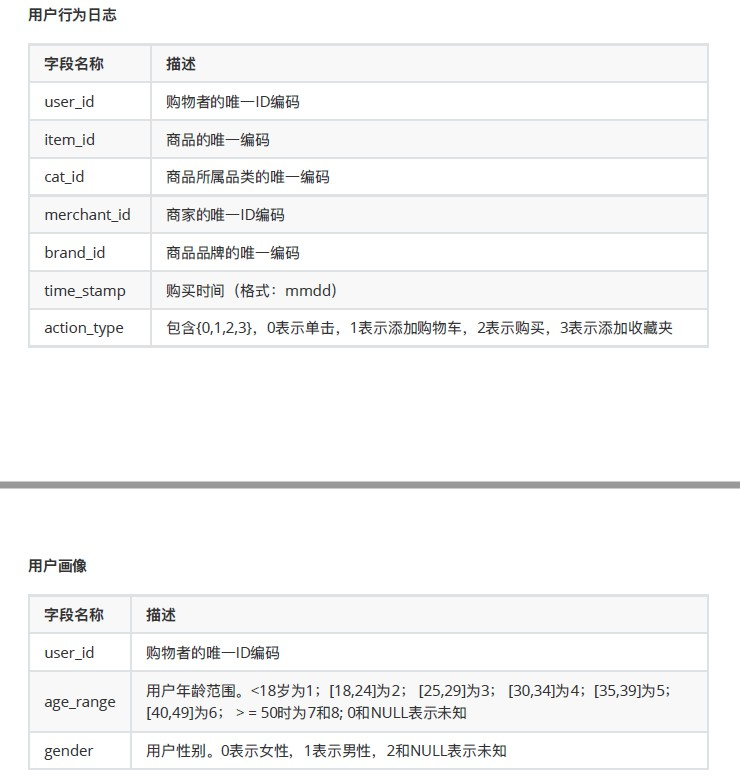
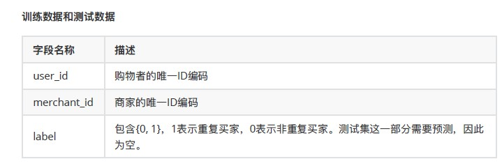

# 实验四

## 作业要求

实验背景：天猫复购预测 https://tianchi.aliyun.com/competition/entrance/231576/information你的任务是预测给定的商家中，哪些新消费者在未来会成为忠实客户，即需要预测这些新消费者在6个⽉月内再次购买的概率。

数据描述
数据集包含了了匿匿名⽤用户在 "双十一 "前6个⽉月和"双⼗十⼀一 "当天的购物记录，标签为是否是重复购买者。出于隐私保护，数据采样存在部分偏差，该数据集的统计结果会与天猫的实际情况有⼀一定的偏差，但不不影响解决⽅方案的适⽤用性。训练集和测试集数据⻅见⽂文件data_format1.zip，数据详情⻅见下表。

任务
1. 分别编写MapReduce程序和Spark程序统计双十一最热门的商品和最受年轻人(age<30)关注的商家（“添加购物⻋车+购买+添加收藏夹”前100名）；
1. 编写Spark程序统计双⼗⼀购买了商品的男⼥⽐例，以及购买了商品的买家年龄段的比例；
2. 基于Hive或者Spark SQL查询双十一购买了了商品的男⼥⽐例，以及购买了商品的买家年年龄段的⽐例；
4. 预测给定的商家中，哪些新消费者在未来会成为忠实客户，即需要预测这些新消费者在6个⽉月内再次购买的概率。基于Spark MLlib编写程序预测回头客，评估实验结果的准确率。

提交⽅式
1. git仓库地址（包括代码、结果和实验报告）
2. 报名参加竞赛，按照要求提交预测结果至⽹站，给出得分和排名。