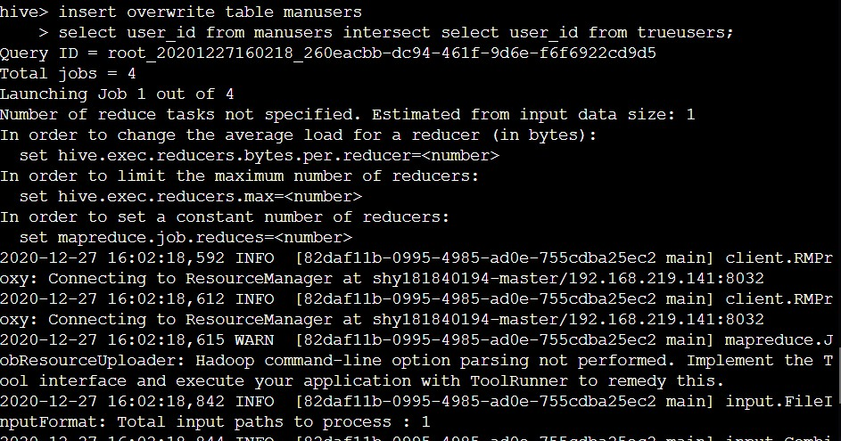
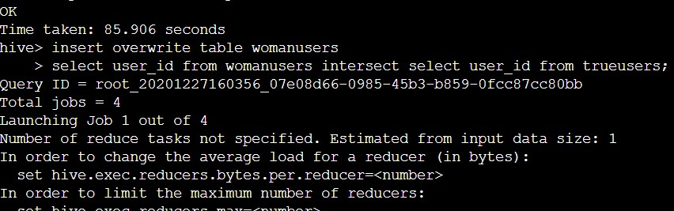

# 实验四

## 仓库结构

>本md文件是本次实验的报告，分为`仓库结构、作业要求、设计思路、实验结果、一些思考`这些部分。本报告内容与课堂所作报告内容无冲突，区别主要在于课堂报告较简略，本报告会做一些补充。

>src/main文件夹中是各题的源代码，共有三种语言，分别是java,scala,python。

>img文件夹中是本md文件用到的各图片

>target文件夹中是各java和scala文件能够打包得到的jar包，可以用hadoop或spark直接运行。

## 作业要求

实验背景：天猫复购预测 https://tianchi.aliyun.com/competition/entrance/231576/information你的任务是预测给定的商家中，哪些新消费者在未来会成为忠实客户，即需要预测这些新消费者在6个⽉月内再次购买的概率。

数据描述
数据集包含了了匿匿名⽤用户在 "双十一 "前6个⽉月和"双⼗十⼀一 "当天的购物记录，标签为是否是重复购买者。出于隐私保护，数据采样存在部分偏差，该数据集的统计结果会与天猫的实际情况有⼀一定的偏差，但不不影响解决⽅方案的适⽤用性。训练集和测试集数据⻅见⽂文件data_format1.zip，数据详情⻅见下表。

任务
1. 分别编写MapReduce程序和Spark程序统计双十一最热门的商品和最受年轻人(age<30)关注的商家（“添加购物⻋车+购买+添加收藏夹”前100名）；
1. 编写Spark程序统计双⼗⼀购买了商品的男⼥⽐例，以及购买了商品的买家年龄段的比例；
2. 基于Hive或者Spark SQL查询双十一购买了了商品的男⼥⽐例，以及购买了商品的买家年年龄段的⽐例；
4. 预测给定的商家中，哪些新消费者在未来会成为忠实客户，即需要预测这些新消费者在6个⽉月内再次购买的概率。基于Spark MLlib编写程序预测回头客，评估实验结果的准确率。

提交⽅式
1. git仓库地址（包括代码、结果和实验报告）
2. 报名参加竞赛，按照要求提交预测结果至⽹站，给出得分和排名。

## 设计思路

#### 第一题

##### 统计最热门商品

只需要进行简单的wordCount，然后按照次数排序，与之前做过的莎士比亚任务类似。也就是在mapreduce中，只需要两个job就可以搞定。

##### 统计年轻人最喜爱的商家

与前者的区别在于需要做筛选，其余步骤类似。筛选是指，需要在log中去掉user_id年龄不符合要求的那些行，并按照merchant_id来计数和排序。这个筛选，我的思路是，把log的记录根据其中包含的user_id部分映射为(记录，user_id)，再利用要去掉的那些user_id来处理这样的tuple，然后再把处理后的tuple映射到记录中的merchant_id部分。

具体方法上，我的思路是，多用spark文档中关于RDD和pair RDD的api。如join，subtractByKey，countByValue等，它们其实非常好用。

在筛选user_id部分，利用pair RDD[(user_id,merchant_id)]，用subtractByKey方法去掉不需要的user_id。整个过程中充分利用map，在RDD和pair RDD之间反复横跳。

#### 第二题

与第一题第二个任务的区别在于，1.要把计数除以总数算出比例，2.要分组计数。其实没有其他区别。不过筛选部分的任务变了，是筛选出购买了商品的记录。

编程的总体思路也是充分利用RDD和pair RDD的api。筛选user_id部分利用pair RDD的join方法，计数部分利用RDD的countByValue方法。

#### 第三题

任务与第三题相同，语言变一下，思路不变。我用的是hive。

#### 第四题

首先是特征构建，我直接参照了baseline的十个特征，没有变动。具体来讲，就是要加载各文件为dataframe，将构建出的各特征添加到dataframe当中，最后得到一个columns中包含了用来作identifier的(user_id,merchant_id)、一串特征、标签的dataframe。以这个dataframe为数据集进行机器学习。

然后是机器学习的策略。我采用了随机森林算法，调整的超参主要包括每棵树的最大深度、每棵树每个split选取的特征数、基学习器的数量。

## 实验结果

#### 第一题

执行指令
输出
执行指令
输出

#### 第二题

执行指令
输出

#### 第三题

执行指令和输出

#### 第四题

auc和准确率

## 一些思考

#### 把问题尽量转换为完全用spark api实现

尤其是用scala语言编写程序时。其实我也不知道spark的api的底层细节，但运行起来效率很高。所以我在实验中总是倾向于使用spark文档中关于RDD和pair RDD的api，如join，subtractByKey，countByValue等，它们其实非常好用。
但是这些api是有对应的数据类型的，所以想要使用它们，就要在解决问题的思路中考虑到数据类型的转换。这也是我在设计思路时的一个主要着力点。

#### sbt环境配置失败

我电脑上的sbt环境配置完全失败，从换版本到换源，各种方法都尝试过，但是还是报奇怪的错误。而且网上搜也搜不到帮助，最终放弃。

#### idea下载maven依赖速度奇慢

idea下载maven速度真的太慢了，哈哈。不过，也不止这一次实验，其实之前所有用maven的实验，我都是这么过来的。翻墙依然龟速。解决方法就是一个一个地从中央仓库手动下载.pom和.jar文件，手动添加至本地仓库。
这个过程确实比较痛苦，大概以后，只要我还在使用目前这台电脑，我都会对maven搭建的项目多少有些抗拒吧。

#### bdkit时不时驱逐我下

哈哈，这个也是没有办法的。虽然想吐槽，但是不可否认，bdkit这学期是我的救命稻草啊，而且是帮助我漂过了太平洋的一根稻草，哈哈。
bdkit总体的使用体验肯定是相当好的。毕竟环境配置才是万恶之源，哈哈。

#### 对实验中使用到的三种语言的感受

我在本次实验中用到了java，scala，python。
对于初次尝试的scala，个人觉得像是java和python的孩子。上手很容易（当然想要写得优雅很难）。python般简洁的编写，加之严谨的类型推断、idea详尽友好的代码提示，很大程度上减轻了做实验的痛苦。我经常写着写着就不想换行了，一定要向没用过的同学强烈推荐。
我觉得对于spark来说，代码编辑方面scala最高效，运行环境方面python最方便。python的这一优点，在硬件设施不理想的情况下，可能会被放大。直接运行python脚本出结果的幸福感，让我更坚定了学会python以来就一直存在的对它的偏爱。哈哈。